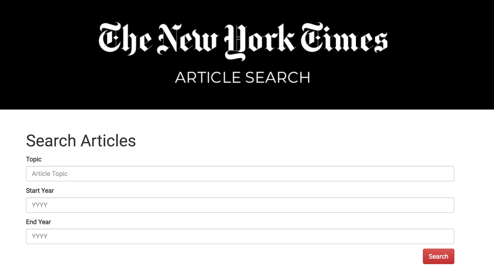
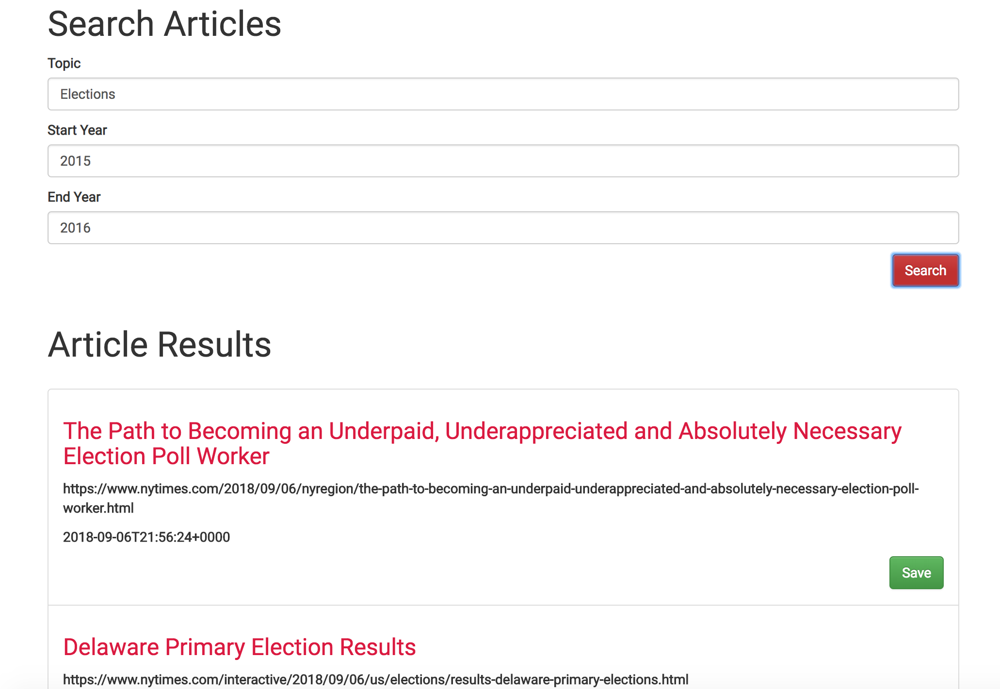
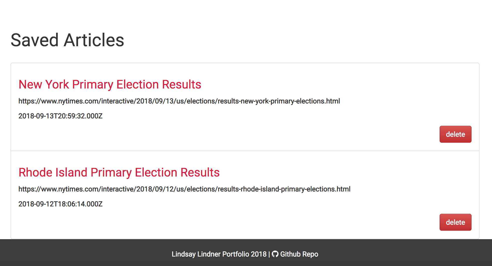

# New York Times Search

React-based New York Times Article Search application. React components, work with helper/util functions, and utilize the React mounting lifecycle to query and display articles based on user searches. Using Node, Express and MongoDB so that users can save articles to read later.

## Apps ##

**React NYT Search**

**Search Results**

**Saved Articles**

[View Full Project](https://limitless-stream-82216.herokuapp.com)

## Tools ##

**Technology Used**
* React
* React Bootstrap
* Node
* Javascript
* Express
* Axios
* MongoDB
* Mongoose
* Heroku
